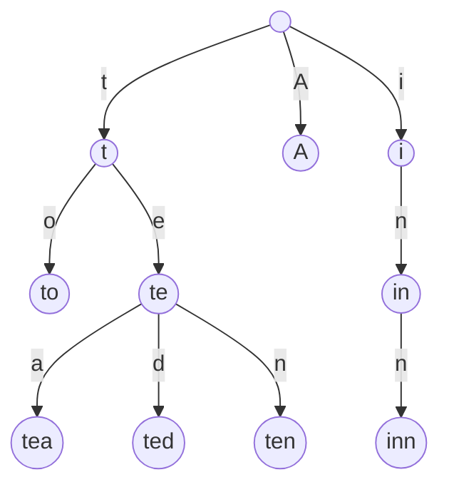

# 字符串算法

## 字符串哈希

个人理解哈希函数是一种可以将巨大的复杂的数据压缩成较小的便于存储的或者更好比较的数据。字符串哈希便是将字符串转换成十进制整数的函数，便于进一步的比较查找操作，这里最好尽量做到字符串对应唯一的哈希值。同时显而易见的是计算哈希值的时间复杂度为$O(L)$，$L$为字符串长，空间复杂度$O(1)$。

> A hash function is any function that can be used to map data of arbitrary size to fixed-size values. The values returned by a hash function are called hash values, hash codes, digests, or simply hashes. The values are used to index a fixed-size table called a hash table. Use of a hash function to index a hash table is called hashing or scatter storage addressing.
>
> Reference: [Wikipedia: Hash function](https://en.wikipedia.org/wiki/Hash_function)

### 常用哈希函数

#### BKDR Hash

```C++
// single hash
unsigned long long BKDR_hash(char *str)
{
    unsigned long long prime = 19260817;
    unsigned long long base = 131;
    unsigned long long hash = 0;
    while (*str)
    {
        hash = (hash * base + *str) % prime;
        str++;
    }
    return hash;
}
// single hash with "overflow"
unsigned long long BKDR_hash_ull(char *str)
{
    unsigned long long base = 131;
    unsigned long long hash = 0;
    while (*str)
    {
        // let it overflow
        hash = hash * base + *str;
        str++;
    }
    return hash & 0x7fffffff;
}
// double hash
unsigned long long prime1 = 19260817;
unsigned long long prime2 = 19660813;
struct hash_table{
    unsigned long long hash_var1, hash_var2;
};
unsigned long long BKDR_hash(char *str, unsigned long long prime)
{
    unsigned long long base = 131;
    unsigned long long hash = 0;
    while (*str)
    {
        hash = (hash * base + *str) % prime;
        str++;
    }
    return hash;
}
```

这里其实就是简单的进制转换算法，`base`的选取满足：

- 大于所有字符的最大值
- 不含模数`prime`的质因子

所以可以选$131, 233, 1313$之类的。

模数的选择最好是质数，比如$1e7+7,1e9+9,233,19260817,19660813$。

同时偷懒的写法是直接使用`unsigned long long`，不手动进行取模，它溢出时会自动对$2^{64}$进行取模。

#### SDBM Hash

```C++
unsigned long long SDBM_hash(char *str)
{
    unsigned long long hash = 0;
    while (*str)
    {
        // 65599 == 2^6 + 2^16 - 1
        // equivalent to
        // hash[i] = hash[i - 1] * 65599 + str[i];

        // let it overflow
        hash = (hash << 6) + (hash << 16) - hash + *str;
        str++;
    }
    return hash & 0x7fffffff;
}
```

一种比较好记的哈希函数，详细见下引用介绍。

> this algorithm was created for sdbm (a public-domain reimplementation of ndbm) database library. it was found to do well in scrambling bits, causing better distribution of the keys and fewer splits. it also happens to be a good general hashing function with good distribution. the actual function is `hash(i) = hash(i - 1) * 65599 + str[i];` what is included below is the faster version used in gawk. [there is even a faster, duff-device version] the magic constant 65599 was picked out of thin air while experimenting with different constants, and turns out to be a prime. this is one of the algorithms used in berkeley db (see sleepycat) and elsewhere.
>
> Reference: [Hash Functions](http://www.cse.yorku.ca/~oz/hash.html)

## 字典树(Trie)

> In computer science, a trie, also called digital tree or prefix tree, is a kind of search tree--an ordered tree data structure used to store a dynamic set or associative array where the keys are usually strings. Unlike a binary search tree, no node in the tree stores the key associated with that node; instead, its position in the tree defines the key with which it is associated. All the descendants of a node have a common prefix of the string associated with that node, and the root is associated with the empty string. Keys tend to be associated with leaves, though some inner nodes may correspond to keys of interest. Hence, keys are not necessarily associated with every node. For the space-optimized presentation of prefix tree, see compact prefix tree.
> Reference: [Wikipedia: Trie](https://en.wikipedia.org/wiki/Trie)

Example: `"A","to","tea","ted","ten","i","in","inn"`



如上图所示，结构一目了然，接下来进行实现。

```c++
struct normalTrie
{
    const static int maxn = 2000005;
    const static int maxalpha = 30; // max-number of sons

    int t[maxn][maxalpha]; // nodes, s[i][j] means node i-th's j-th son
    int sum[maxn];         // the number of words beginning with "xxx"
    bool isWord[maxn];
    int tot;

    void init()
    {
        memset(t, 0, sizeof(t));
        memset(sum, 0, sizeof(sum));
        memset(isWord, false, sizeof(isWord));
        tot = 0;
    }

    void insert(char *str)
    {
        int len = strlen(str);
        int p = 0;
        for (int i = 0; i < len; i++)
        {
            int c = str[i] - '0';
            if (t[p][c] == 0)
                t[p][c] = ++tot;
            p = t[p][c];
            sum[p]++;
        }
        isWord[p] = true;
    }

    int find(char *str)
    {
        int len = strlen(str);
        int p = 0;
        for (int i = 0; i < len; i++)
        {
            int c = str[i] - '0';
            if (t[p][c] == 0)
                return 0;
            p = t[p][c];
        }
        return sum[p];
    }

    void insert(string str) { this->find(str.c_str()); }
    int find(string str) { return this->find(str.c_str()); }

} trie;

```

### 性能分析

字典树的查找和插入单词的时间复杂度都是$O(L)$，这个$L$是单词的长度。它比哈希表更优吗？看似哈希表查找和插入均为$O(1)$，事实上，哈希表在针对字符串进行查询和插入操作之前，它需要事先计算该字符串的哈希值，如果将这一过程的时间算上，哈希表的查询与c插入操作均为$O(L)$，略逊于字典树。而对于空间复杂度，字典树在字符种类有限的情况下表现更优。
